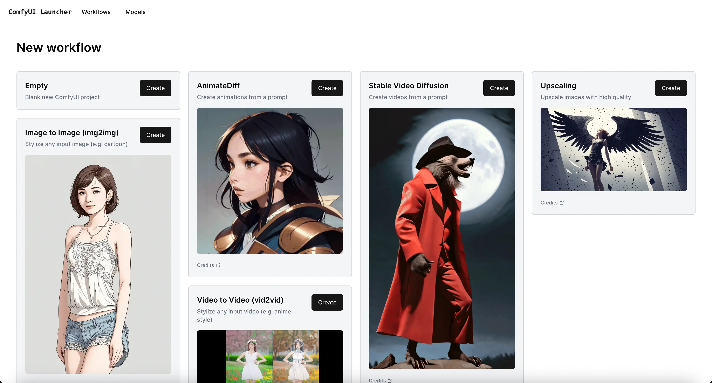
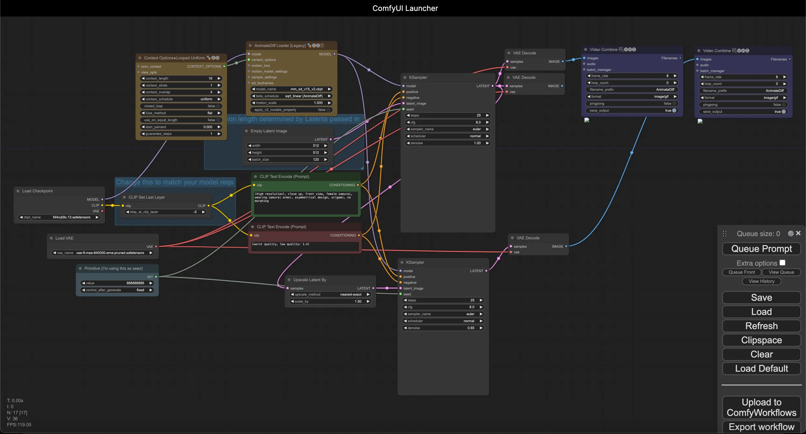

[English](README.md) | [Русский](README.ru.md)

# JL-ComfyUI-Launcher (Enhanced Version)

Run any ComfyUI workflow with **ZERO setup**. This is an enhanced fork of the original ComfyUI Launcher with significant improvements in stability, error handling, and functionality.

<p float="middle">
  
  
  
  
</p>

## Community
Join our community:
- [Telegram Group](https://t.me/JL_Stable_Diffusion) - News, updates, and AI discussions
- [Boosty Blog](https://boosty.to/jlsd) - Builds, tutorials, and more

## Demo

Example of running a workflow without setup:

https://github.com/user-attachments/assets/7e3e9330-b2ff-467d-9015-a31c433882f8

## Quick Installation

To create a portable version, you don't need to clone the entire repository. Just download these two files:

### Windows
1. Download:
   - [build_portable.py](https://raw.githubusercontent.com/John-LapTev/JL-ComfyUI-Launcher/main/builder/build_portable.py)
   - [run_as_admin.bat](https://raw.githubusercontent.com/John-LapTev/JL-ComfyUI-Launcher/main/builder/scripts/run_as_admin.bat)
2. Place both files in one directory
3. Run `run_as_admin.bat`

### MacOS
1. Download:
   - [build_portable.py](https://raw.githubusercontent.com/John-LapTev/JL-ComfyUI-Launcher/main/builder/build_portable.py)
   - [run_as_admin.sh](https://raw.githubusercontent.com/John-LapTev/JL-ComfyUI-Launcher/main/builder/scripts/run_as_admin.sh)
2. Place both files in one directory
3. Make script executable: `chmod +x run_as_admin.sh`
4. Run: `sudo ./run_as_admin.sh`

## Key Improvements

### 1. Enhanced Reliability
- Improved error handling during installation
- Better dependency management
- Fixed symbolic link issues
- Automatic retries during downloads
- Download speed monitoring
- Enhanced file integrity checks

### 2. Project Management
- Automatic creation of bat-files for each project
- Improved workflow import system
- Better dependency handling
- Enhanced status monitoring
- Installation progress visualization
- Each project in its own isolated environment

### 3. Model Management
- Automatic model detection and downloading
- Proper model sorting by folders
- Original filename preservation
- Correct dependency and path setup
- Download process visualization
- Support for various model sources

### 4. Technical Improvements
- Enhanced Python environment setup
- Better CUDA integration
- Improved virtual environment management
- Enhanced logging system
- Support for multiple model sources
- Optimized package installation

## Getting Started

### Option 1: Download Ready-to-Use Version
Download and extract the ready-made build:
- [CUDA Version](https://jl-comfyui.hhos.net/JL-Portable/ComfyUI-Launcher-Portable-CUDA.7z) (for NVIDIA GPUs)
- DirectML Version (for AMD/Intel GPUs) - Coming Soon
- CPU Version - Coming Soon
- MacOS Version - Coming Soon

### Option 2: Build from Source
```bash
git clone https://github.com/John-LapTev/JL-ComfyUI-Launcher.git
cd JL-ComfyUI-Launcher/builder
```
Detailed build instructions:
- [Windows Instructions](builder/README_Windows.md)
- [MacOS Instructions](builder/README_MacOS.md)

## System Requirements

### Windows
- Windows 10 or 11
- NVIDIA GPU recommended (for CUDA version)
- AMD or Intel GPU (for DirectML version)
- Minimum 8GB RAM (16GB recommended)
- 20GB free disk space

### MacOS
- MacOS 11 or newer
- Minimum 8GB RAM (16GB recommended)
- 20GB free disk space

## First Launch
1. Run `start.bat` (Windows) or `start.sh` (MacOS)
2. Wait for initial setup to complete
3. Open interface at http://localhost:4000

## Important Notes
- Add launcher folder to antivirus exclusions
- Close all ComfyUI processes before launching
- Ensure sufficient disk space
- Install in a directory with a short path (e.g., `C:\ComfyUI` instead of `C:\Users\Username\Documents\Projects\ComfyUI`)

## Troubleshooting

### Common Issues
1. Close all ComfyUI windows
2. Delete .celery folder in server directory if it exists
3. Restart start.bat/start.sh
4. Check log files in launcher folder

### Long Path Issues in Windows
If you encounter errors related to long paths during installation or workflow import:

1. Enable long path support in Windows:
   - Open Group Policy Editor (gpedit.msc)
   - Navigate to: Computer Configuration → Administrative Templates → System → Filesystem
   - Find "Enable Win32 long paths"
   - Set to "Enabled"
   - Restart computer

2. Or use a short installation path:
   - Install launcher closer to drive root
   - Example: `C:\ComfyUI` instead of `C:\Users\Username\Documents\Projects\ComfyUI`

## Development
Want to contribute? Great!
1. Fork the repository
2. Create a branch for your feature
3. Commit your changes
4. Push to the branch
5. Create Pull Request

## Project Support
If you find this project useful:
- [Support on Boosty](https://boosty.to/jlsd/donate)

## Acknowledgments
- Original ComfyUI Launcher by ComfyWorkflows
- ComfyUI Manager (https://github.com/ltdrdata/ComfyUI-Manager/)

## License
GNU Affero General Public License v3.0 - see [LICENSE](LICENSE) for details