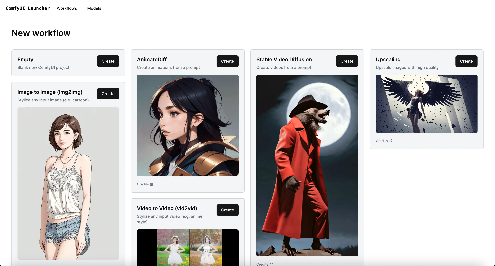
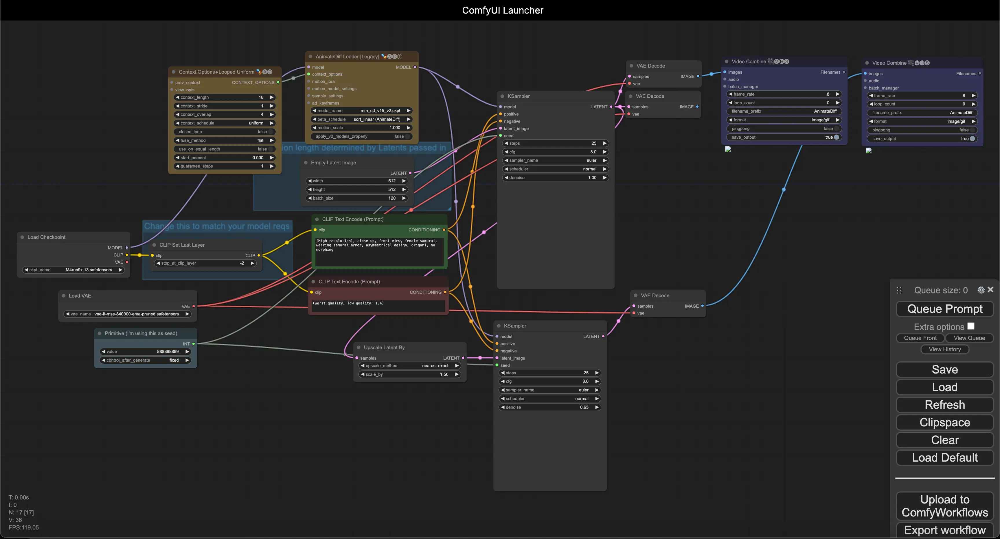

[English](README.md) | [Русский](README.ru.md)

# JL-ComfyUI-Launcher (Улучшенная версия)

Запускайте любой ComfyUI воркфлоу с **НУЛЕВОЙ настройкой**. Это улучшенный форк оригинального ComfyUI Launcher со значительными улучшениями в стабильности, обработке ошибок и функциональности.

<p float="middle">
  
  
  
  
</p>

## Сообщество
Присоединяйтесь к нашему сообществу:
- [Группа Telegram](https://t.me/JL_Stable_Diffusion) - Новости, обновления и обсуждения AI
- [Блог на Boosty](https://boosty.to/jlsd) - Сборки, туториалы и многое другое

## Демонстрация

Пример запуска workflow без настройки:

<video width="600" controls>
  <source src="https://jl-comfyui.hhos.net/GitHub/JL-ComfyUI-Launcher/assets/demo.mp4" type="video/mp4">
  Ваш браузер не поддерживает видео тег.
</video>

## Быстрая Установка

Для создания портативной версии не обязательно клонировать весь репозиторий. Достаточно скачать два файла:

### Windows
1. Скачайте:
   - [build_portable.py](https://raw.githubusercontent.com/John-LapTev/JL-ComfyUI-Launcher/main/builder/build_portable.py)
   - [run_as_admin.bat](https://raw.githubusercontent.com/John-LapTev/JL-ComfyUI-Launcher/main/builder/scripts/run_as_admin.bat)
2. Поместите оба файла в одну директорию
3. Запустите `run_as_admin.bat`

### MacOS
1. Скачайте:
   - [build_portable.py](https://raw.githubusercontent.com/John-LapTev/JL-ComfyUI-Launcher/main/builder/build_portable.py)
   - [run_as_admin.sh](https://raw.githubusercontent.com/John-LapTev/JL-ComfyUI-Launcher/main/builder/scripts/run_as_admin.sh)
2. Поместите оба файла в одну директорию
3. Сделайте скрипт исполняемым: `chmod +x run_as_admin.sh`
4. Запустите: `sudo ./run_as_admin.sh`

## Ключевые Улучшения

### 1. Повышенная Надёжность
- Улучшенная обработка ошибок при установке
- Лучшее управление зависимостями
- Исправлены проблемы с символическими ссылками
- Автоматические повторные попытки при загрузке
- Мониторинг скорости загрузки
- Улучшенная проверка целостности файлов

### 2. Управление Проектами
- Автоматическое создание bat-файлов для каждого проекта
- Улучшенная система импорта воркфлоу
- Лучшая обработка зависимостей
- Улучшенный мониторинг статуса
- Визуализация прогресса установки
- Каждый проект в собственном изолированном окружении

### 3. Управление Моделями
- Автоматическое определение и загрузка моделей
- Правильная сортировка моделей по папкам
- Сохранение оригинальных имен файлов
- Корректная установка зависимостей и путей
- Визуализация процесса загрузки
- Поддержка различных источников моделей

### 4. Технические Улучшения
- Улучшенная настройка окружения Python
- Лучшая интеграция с CUDA
- Улучшенное управление виртуальным окружением
- Улучшенная система логирования
- Поддержка нескольких источников для моделей
- Оптимизированная установка пакетов

## Начало Работы

### Вариант 1: Скачать Готовую Версию
Скачайте и распакуйте готовую сборку:
- [Версия CUDA](https://jl-comfyui.hhos.net/JL-Portable/ComfyUI-Launcher-Portable-CUDA.7z) (для видеокарт NVIDIA)
- Версия DirectML (для видеокарт AMD/Intel) - Скоро
- Версия CPU - Скоро
- Версия MacOS - Скоро

### Вариант 2: Сборка из Исходников
```bash
git clone https://github.com/John-LapTev/JL-ComfyUI-Launcher.git
cd JL-ComfyUI-Launcher/builder
```
Подробные инструкции по сборке:
- [Инструкция для Windows](builder/README_Windows.ru.md)
- [Инструкция для MacOS](builder/README_MacOS.ru.md)

## Системные Требования

### Windows
- Windows 10 или 11
- Рекомендуется NVIDIA GPU (для версии CUDA)
- AMD или Intel GPU (для версии DirectML)
- Минимум 8GB RAM (рекомендуется 16GB)
- 20GB свободного места на диске

### MacOS
- MacOS 11 или новее
- Минимум 8GB RAM (рекомендуется 16GB)
- 20GB свободного места на диске

## Первый Запуск
1. Запустите `start.bat` (Windows) или `start.sh` (MacOS)
2. Дождитесь завершения начальной настройки
3. Откройте интерфейс по адресу http://localhost:4000

## Важные Замечания
- Добавьте папку лаунчера в исключения антивируса
- Закройте все процессы ComfyUI перед запуском
- Убедитесь, что достаточно места на диске
- Рекомендуется устанавливать в директорию с коротким путём (например, `C:\ComfyUI` вместо `C:\Users\Username\Documents\Projects\ComfyUI`)

## Решение Проблем

### Общие Проблемы
1. Закройте все окна ComfyUI
2. Удалите папку .celery в папке server, если она существует
3. Перезапустите start.bat/start.sh
4. Проверьте файлы логов в папке лаунчера

### Проблема с Длинными Путями в Windows
Если при установке или импорте workflow возникает ошибка, связанная с длинными путями:

1. Включите поддержку длинных путей в Windows:
   - Откройте редактор групповой политики (gpedit.msc)
   - Перейдите: Конфигурация компьютера → Административные шаблоны → Система → Файловая система
   - Найдите "Enable Win32 long paths"
   - Установите значение "Включено"
   - Перезагрузите компьютер

2. Или используйте короткий путь установки:
   - Устанавливайте лаунчер ближе к корню диска
   - Например: `C:\ComfyUI` вместо `C:\Users\Username\Documents\Projects\ComfyUI`

## Разработка
Хотите внести свой вклад? Отлично!
1. Сделайте форк репозитория
2. Создайте ветку для вашей функции
3. Зафиксируйте изменения
4. Отправьте в ветку
5. Создайте Pull Request

## Поддержка Проекта
Если вам полезен этот проект:
- [Поддержать на Boosty](https://boosty.to/jlsd/donate)

## Благодарности
- Оригинальный ComfyUI Launcher от ComfyWorkflows
- ComfyUI Manager (https://github.com/ltdrdata/ComfyUI-Manager/)

## Лицензия
GNU Affero General Public License v3.0 - подробности в [LICENSE](LICENSE)